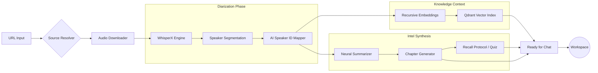
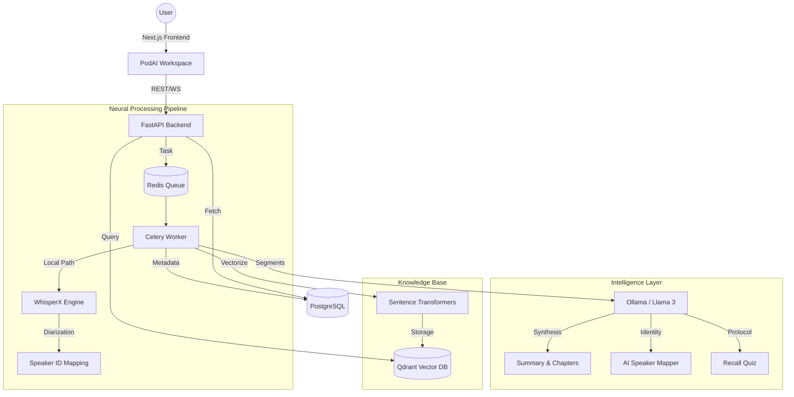

# 🎙️ PodAI: Neural Podcast Intelligence Workspace

PodAI is a state-of-the-art, local-first intelligence platform designed to transform passive podcast listening into active knowledge synthesis. Utilizing a high-performance neural pipeline, PodAI transcribes, diarizes, and analyzes podcast content to provide actionable insights, recursive learning tools, and a context-aware research assistant.


---

## ⚡ Core Intelligence Features

- **🧠 Neural Summarization**: Phase-based extraction of global narratives, key takeaways, and recursive action items.
- **👥 AI Speaker Diarization**: Beyond just "Speaker 00". Our pipeline identifies speakers by name using contextual cues and self-introductions.
- **📋 Smart Chaptering**: Automatically generated, timestamped indices with abstractive summaries for non-linear navigation.
- **🧩 Knowledge Vault (Glossary)**: Automated extraction of technical terms and niche concepts with contextual definitions.
- **🎯 Recall Protocol (Quiz)**: AI-generated assessment tools for content retention and self-testing.
- **✨ Intelligence Probes**: Predictive suggested questions tailored to each episode's unique knowledge density.
- **💬 PodAI Chat**: A RAG-powered (Retrieval-Augmented Generation) assistant that references the specific podcast transcript for zero-hallucination answers.

---

## 🔄 The Processing Lifecycle

How PodAI transforms raw audio into structured intelligence:



1.  **Ingestion**: Source URL is resolved and audio is retrieved.
2.  **Transcription & Diarization**: WhisperX performs timestamped transcription with initial speaker clustering.
3.  **Speaker Identity Mapping**: Ollama analyzes conversational cues to map clusters to real identities (e.g., *Speaker 00* → *Ian Buck*).
4.  **Synthesis**: Recursive LLM passes generate premium summaries, actionable chapters, and technical glossaries.
5.  **Assessment Generation**: The Recall Protocol creates an evidence-based quiz to verify knowledge retention.
6.  **Vector Indexing**: Content is chunked and embedded for ultra-fast, semantic RAG queries in the chat interface.

---

## 🏗️ System Architecture




---

## 🛠️ Technology Stack

| Layer | Technologies |
| :--- | :--- |
| **Frontend** | Next.js 15+, React 19, TypeScript, Tailwind CSS v4, Framer Motion |
| **Backend** | FastAPI, SQLAlchemy (SQLModel), Pydantic v2 |
| **AI/ML Engine** | WhisperX (Transcription/Diarization), Ollama (LLM Synthesis) |
| **Vector Search** | Qdrant (HNSW Indexing), Sentence-Transformers |
| **Data Storage** | PostgreSQL, Redis |
| **Infrastructure** | Docker, Celery (Distributed Processing) |

---

## 🚀 Quick Start (Production Setup)

### Prerequisites
- **Docker & Compose**: Required for containerized services.
- **Ollama**: Running locally or via Docker.
- **NVIDIA GPU**: Highly recommended for WhisperX and Embedding speed.

### Installation

1. **Clone the Infrastructure**:
   ```bash
   git clone https://github.com/yourusername/podcast-summarizer.git
   cd podcast-summarizer
   ```

2. **Configure Environment**:
   ```bash
   cp .env.example .env
   # Edit .env with your local paths and API keys
   ```

3. **Orchestrate Services**:
   ```bash
   docker compose up -d --build
   ```

4. **Initialize Models**:
   ```bash
   docker compose exec ollama ollama pull llama3
   docker compose exec api python -m app.db.init_db
   ```

---

## ✅ Quality & Operations

### Backend Test Baseline
- Test config: `backend/pytest.ini`
- Test deps: `backend/requirements-test.txt`
- Initial suites:
  - `backend/tests/test_security_unit.py`
  - `backend/tests/test_error_handling_integration.py`

Run locally (Dockerized):
```bash
docker compose run --rm api-test
# or
make test
```

### CI Pipeline
- GitHub Actions workflow: `.github/workflows/backend-ci.yml`
- Triggers on `push` and `pull_request`
- Runs backend tests with coverage inside Docker (`api-test` service)

### Structured Logging
- Logging module: `backend/app/core/logging.py`
- App-level integration: `backend/app/main.py`
- Includes:
  - JSON logs (`LOG_JSON=true/false`)
  - Configurable level (`LOG_LEVEL=INFO|DEBUG|...`)
  - Request correlation via `X-Request-ID`
  - Global unhandled exception capture with request id in response

### API Error Handling & Validation
- Centralized handlers in `backend/app/core/errors.py`
- Unified error envelope:
  - `error.code`
  - `error.message`
  - `error.request_id`
  - `error.details` (validation failures)
- Pydantic v2 strict input validation added for:
  - auth payloads
  - ingest payload
  - chat payloads

### Rate Limiting & Auth Security
- Global limiter with `slowapi` (`backend/app/core/rate_limit.py`)
- Auth endpoint limits:
  - `/v1/register`
  - `/v1/login`
  - `/v1/refresh`
- JWT now uses both:
  - short-lived `access_token`
  - rotatable `refresh_token`
- Configurable with:
  - `ACCESS_TOKEN_EXPIRE_MINUTES`
  - `REFRESH_TOKEN_EXPIRE_MINUTES`
  - `RATE_LIMIT_DEFAULT`
  - `RATE_LIMIT_AUTH`

### Caching Strategy
- Redis-backed API response cache in `backend/app/core/cache.py`
- Cached episode reads:
  - transcript
  - summary (persona-aware key)
  - chapters
  - glossary
  - quiz
- Invalidation on episode delete.
- HTTP cache headers:
  - Backend per-route `Cache-Control` middleware
  - Frontend `next.config.ts` static/page cache headers

### DB Performance (Sprint)
- Connection pooling:
  - `DB_POOL_SIZE`, `DB_MAX_OVERFLOW`, `DB_POOL_TIMEOUT`, `DB_POOL_RECYCLE`, `DB_POOL_PRE_PING`
- Slow query profiling:
  - `DB_SLOW_QUERY_MS` threshold (logs as `db.slow_query`)
- Migration:
  - `backend/migrations/versions/d2f8c5a91b11_add_performance_indexes.py`
  - Adds composite indexes for episode feeds, per-episode content fetches, graph joins, and chat history queries.

### Summary Quality Eval (Sprint 2)
- Offline evaluator: `backend/eval_summary_quality.py`
- Scores:
  - evidence coverage
  - average insight confidence
  - topic transition quality
  - actionability

Run in Docker:
```bash
docker compose exec api python eval_summary_quality.py --limit 30
docker compose exec api python eval_summary_quality.py --episode-id 42 --json
```

### LLM Orchestration (Sprint)
- Provider switching via env:
  - `LLM_PROVIDER=ollama|openai|anthropic`
  - `OLLAMA_MODEL`, `OPENAI_MODEL`, `ANTHROPIC_MODEL`
- Fallback chain:
  - `LLM_FALLBACK_CHAIN=ollama:llama3,openai:gpt-4o-mini`
- Reliability:
  - exponential backoff retry (`LLM_MAX_RETRIES`, `LLM_RETRY_BACKOFF_BASE_SEC`)
  - circuit breaker (`LLM_CIRCUIT_BREAKER_FAILURES`, `LLM_CIRCUIT_BREAKER_COOLDOWN_SEC`)
- Context window management:
  - configurable context (`LLM_NUM_CTX`)
  - token estimation + truncation + warning threshold (`LLM_CTX_WARN_RATIO`)

### Retrieval Quality (Sprint)
- HyDE query expansion in chat retrieval.
- Iterative query refinement using first-pass snippets.
- Multi-hop query generation for related evidence exploration.

### Chat Context & Citation Quality (Sprint)
- Context window optimization for long conversations:
  - larger raw history fetch
  - compressed older-turn summary
  - compressed cross-episode memory
  - verified RAG context before answer generation
- Source quality improvements:
  - speaker attribution when available
  - exact quote boundary mapping (`quote_start`, `quote_end`)
  - confidence score per citation
  - credibility ranking per source
- New chat modes:
  - `debate`
  - `storyteller`
  - `teacher`
  - `fact_checker`
  - `casual`
- Feedback loops:
  - thumbs up/down
  - citation helpfulness + notes
  - answer relevance rating
  - conversation rating (1-5)

### Quiz Generation Quality (Sprint)
- Parametrized question generation:
  - `count`
  - `difficulty_profile` (easy/medium/hard mix)
  - `cognitive_targets` (Bloom-aligned levels)
- Diversity targets across question types:
  - factual recall
  - speaker attribution
  - concept application
  - causal reasoning
  - compare/contrast

### Summary Intelligence Depth (Sprint)
- Hierarchical summary layers:
  - Level 1 TL;DR (single sentence)
  - Level 2 executive summary (3-5 sentences)
  - Level 3 detailed outline (section summaries)
  - Level 4 structured notes
- Multi-perspective summaries:
  - business
  - technical
  - personal development
  - investor
- High-value moment detection:
  - emotional intensity
  - revelation points
  - transition moments
  - call-to-action moments
- Categorized insights:
  - core concepts
  - surprising facts
  - actionable tips
  - questions raised
  - contradictions discovered
  - predictions made
- Conversation flow analysis:
  - Q&A patterns
  - debate structures
  - power dynamics
- Action item quality:
  - explicit vs implicit
  - priority
  - ownership
  - timeline

---

## 🎨 Design Aesthetics
PodAI utilizes a **Glassmorphic Cyber-Minimalist** design system:
- **HSL-defined Palettes**: Harmonious dark mode with primary cobalt accents.
- **Micro-interactions**: Framer Motion powered transitions for layout shifts and loading states.
- **Typography**: Focused on readability using *Outfit* for headings and *Geist* for mono/data components.

---

## 📄 License
MIT © 2026 PodAI Team
