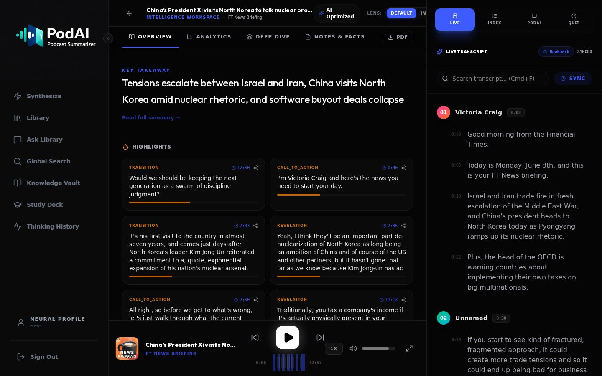
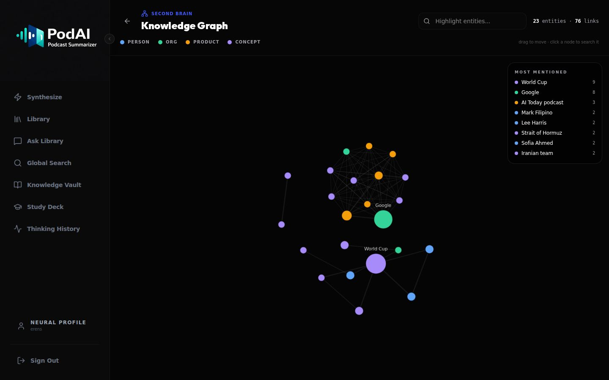
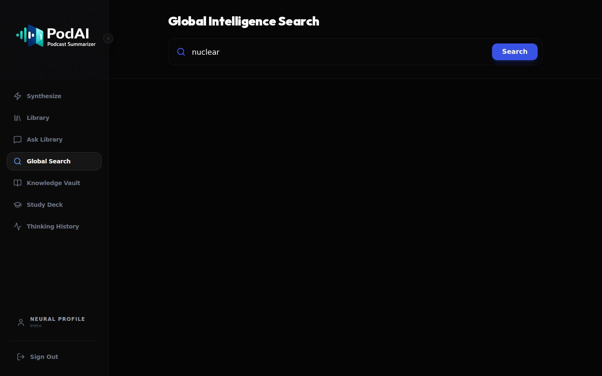
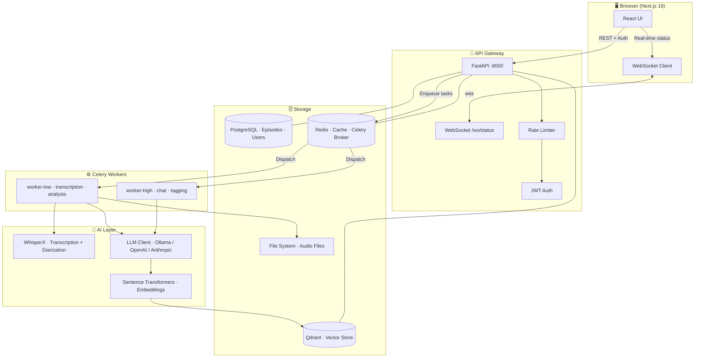
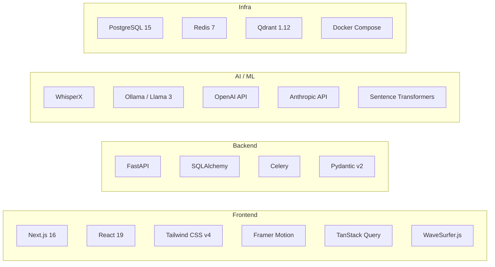
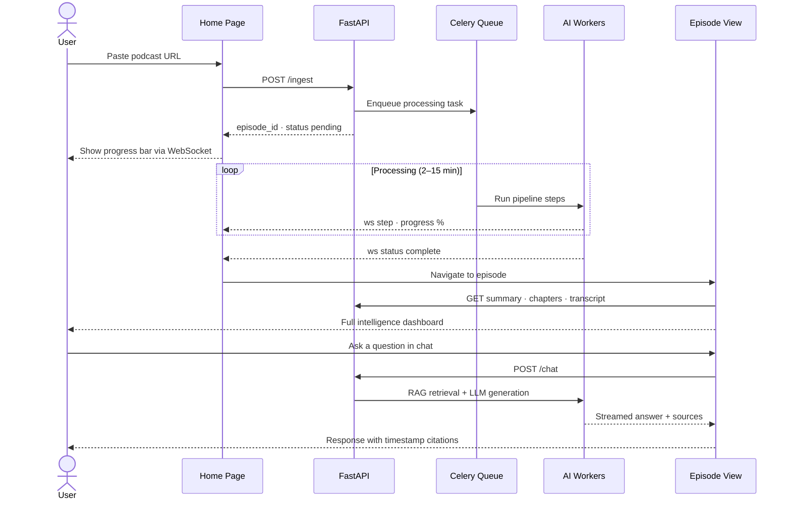
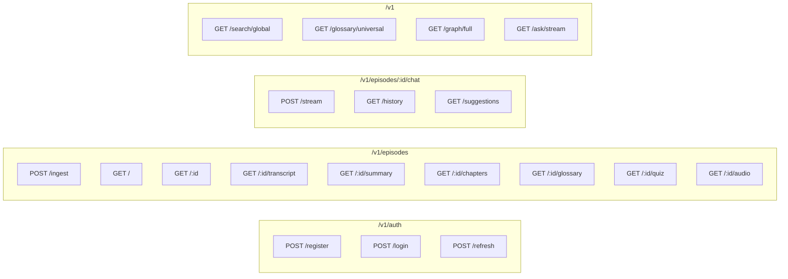

<div align="center">

# 🎙️ PodAI

### Neural Podcast Intelligence Workspace

*Transform passive listening into active knowledge synthesis*

[](https://fastapi.tiangolo.com)
[](https://nextjs.org)
[](https://python.org)
[](https://typescriptlang.org)
[](https://docker.com)
[](LICENSE)

</div>

PodAI ingests any podcast — from a Spotify URL, Apple Podcasts link, or raw RSS feed — and produces a full intelligence layer: speaker-tagged transcripts, multi-perspective summaries, auto-generated chapters, a technical glossary, evidence-grounded quizzes, and a RAG-powered chat interface that lets you query the episode like a document.

---

<div align="center">
  
  
  
  
</div>

<div align="center">

https://github.com/user-attachments/assets/a3477b39-7700-42cf-a8f9-286eef92e243

</div>

---

## Table of Contents

- [Features](#features)
- [Architecture](#architecture)
- [Processing Pipeline](#processing-pipeline)
- [Tech Stack](#tech-stack)
- [Quick Start](#quick-start)
- [Configuration](#configuration)
- [API Overview](#api-overview)
- [Project Structure](#project-structure)

---

## Features

| Category | Capabilities |
|----------|-------------|
| **Ingestion** | Spotify, Apple Podcasts, RSS feeds, direct audio URLs |
| **Transcription** | WhisperX with speaker diarization; AI-inferred speaker names |
| **Summarization** | TL;DR · Executive Brief · Detailed Outline · Structured Notes |
| **Navigation** | Auto-generated chapters with timestamps and abstractive summaries |
| **Vocabulary** | Technical glossary extraction; universal cross-episode knowledge vault |
| **Learning** | Evidence-grounded quizzes with configurable difficulty & cognitive targets |
| **Chat** | RAG-powered Q&A over episode content with source attribution |
| **Search** | Semantic search across your entire episode library |
| **Knowledge Graph** | Entity extraction and relationship visualization |
| **Multilingual** | 11 languages: EN · TR · FR · ES · DE · IT · PT · RU · ZH · JA · KO |
| **LLM Providers** | Ollama (local) · OpenAI · Anthropic — with fallback chains |

---

## Architecture



---

## Processing Pipeline

When a URL is submitted, a deterministic pipeline runs asynchronously and streams progress to the browser over WebSocket:

```mermaid
flowchart LR
    A(["🔗 URL"]) --> B["Resolve Source\nSpotify · Apple · RSS"]
    B --> C["Download Audio"]
    C --> D["WhisperX\nTranscription"]
    D --> E["Speaker\nDiarization"]
    E --> F["Speaker Name\nInference via LLM"]
    F --> G["Summarization\n4 layers"]
    G --> H["Chapter\nGeneration"]
    H --> I["Glossary +\nQuiz Generation"]
    I --> J["Vector\nEmbedding → Qdrant"]
    J --> K(["✅ Ready"])

    style A fill:#1a1a2e,color:#fff
    style K fill:#16213e,color:#4ade80
```



---

## Tech Stack



---

## User Journey



---

## Quick Start

### Prerequisites

- Docker & Docker Compose
- **NVIDIA GPU + NVIDIA Container Toolkit** — required by the default `docker-compose.yml` for Ollama, transcription, and embeddings. To run CPU-only, remove the `deploy.resources.reservations` blocks from `ollama`, `worker-low`, and `worker-high` (expect slower processing).
- 16 GB RAM minimum; 32 GB recommended for local LLM

### 1. Clone & configure

```bash
git clone https://github.com/erenkbgc/podcast_summarizer.git
cd podcast_summarizer
cp .env.example .env
```

Edit `.env` — the minimum required variables:

```env
SECRET_KEY=your-secret-key-here          # Generate: openssl rand -hex 32
POSTGRES_PASSWORD=changeme
FLOWER_PASSWORD=change_me_in_production

# Choose ONE provider (or set up a fallback chain)
LLM_PROVIDER=ollama                       # ollama | openai | anthropic
OPENAI_API_KEY=sk-...                     # if using OpenAI
ANTHROPIC_API_KEY=sk-ant-...             # if using Anthropic

# Optional: Spotify episode resolution
SPOTIFY_CLIENT_ID=...
SPOTIFY_CLIENT_SECRET=...

# Optional: WhisperX speaker diarization
HF_TOKEN=hf_...
```

### 2. Start services

```bash
docker compose --profile prod up -d --build
```

The `prod` profile starts everything: PostgreSQL · Redis · Qdrant · Ollama · FastAPI · two Celery workers · Flower · frontend. Omit `--profile prod` to skip the containerized frontend and run it locally with `npm run dev`.

### 3. Initialize the database

```bash
docker compose exec api alembic upgrade head
```

### 4. Pull the LLM model (Ollama only)

```bash
docker compose exec ollama ollama pull mistral
```

### 5. Open the app

| Service | URL |
|---------|-----|
| Web App | http://localhost:3001 |
| API Docs | http://localhost:8000/docs |
| Flower (queue monitor) | http://localhost:5555 |
| Qdrant Dashboard | http://localhost:6333/dashboard |

### 6. Register and ingest

1. Go to `http://localhost:3001/register` and create an account
2. Paste any podcast URL on the home page
3. Watch the real-time progress bar
4. Explore the intelligence dashboard when processing completes

---

## Configuration

All options live in `.env`:

```env
# LLM — fallback chain (tries providers left-to-right on failure)
LLM_PROVIDER=ollama
OLLAMA_MODEL=mistral
LLM_FALLBACK_CHAIN=ollama:mistral

# Pipeline behavior
SUMMARY_MODE=tldr            # tldr | standard | deep
TRANSLATE_TRANSCRIPT=false
FACT_CHECK_PROVIDER=none     # none | searxng

# Rate limiting
RATE_LIMIT_AUTH=10/minute
RATE_LIMIT_INGEST=10/minute
RATE_LIMIT_CHAT=30/minute

# Cache TTLs (seconds)
CACHE_DEFAULT_TTL_SEC=120
CACHE_EPISODE_TTL_SEC=300

# Database pool
DB_POOL_SIZE=10
DB_MAX_OVERFLOW=20
```

---

## API Overview

Full interactive documentation at `/docs` (Swagger UI) and `/redoc`.



> All endpoints except `/auth` require a `Bearer` JWT token.

---

## Project Structure

```
podcast_summarizer/
├── backend/
│   ├── app/
│   │   ├── api/v1/endpoints/     # Route handlers
│   │   │   ├── auth.py
│   │   │   ├── podcast.py        # Episodes, ingest, chat
│   │   │   ├── discovery.py      # Search, knowledge graph
│   │   │   └── ws.py             # WebSocket status
│   │   ├── services/             # Business logic
│   │   │   ├── llm_client.py     # Multi-provider LLM with fallback
│   │   │   ├── transcriber.py    # WhisperX + diarization
│   │   │   ├── chat.py           # RAG chat engine
│   │   │   ├── vector_store.py   # Qdrant client
│   │   │   ├── quiz_builder.py   # Assessment generation
│   │   │   └── source_resolver.py
│   │   ├── models/               # SQLAlchemy ORM
│   │   ├── schemas/              # Pydantic v2 schemas
│   │   ├── core/                 # Config, security, cache, rate limiting
│   │   ├── db/                   # Session, migrations
│   │   └── worker/
│   │       ├── celery_app.py     # Queue configuration
│   │       └── tasks.py          # Processing pipeline
│   ├── migrations/               # Alembic versions
│   └── Dockerfile
│
├── frontend/
│   └── src/
│       ├── app/                  # Next.js App Router pages
│       │   ├── page.tsx          # Home / ingest
│       │   ├── library/          # Episode library
│       │   ├── episode/[id]/     # Episode detail
│       │   ├── search/           # Semantic search
│       │   ├── knowledge/        # Glossary + graph
│       │   ├── ask/              # Global RAG chat
│       │   └── study/            # Quiz / study mode
│       ├── components/           # React components
│       ├── hooks/                # usePodcastSocket (WebSocket)
│       ├── context/              # AuthContext
│       └── lib/                  # API client, utilities
│
├── docker-compose.yml
├── Makefile
└── .env.example
```

---

## Development

```bash
make up          # Start all services
make logs-api    # Stream API logs
make shell-api   # Shell into the API container
make test        # Run backend tests
make down        # Stop all services
```

---

## License

MIT — see [LICENSE](LICENSE).

---

<div align="center">
<sub>Built with WhisperX · Ollama · FastAPI · Next.js</sub>
</div>
